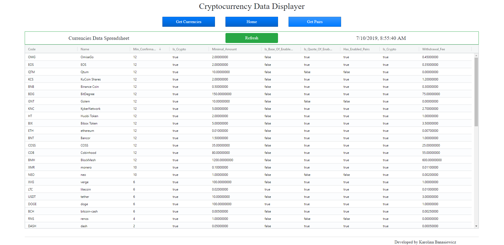

<!-- PROJECT HEADER -->
 

  <h3 align='center' style='font-size: 32px'>Cryptocurrency Data Displayer</h3>
  

    Application for accessing the data and presenting it in a table.
     
     
    <a href='https://skkarolinav.github.io/hyperting-project/' style='font-size: 20px'>View Live Demo</a>
  

#
<!-- TABLE OF CONTENTS -->
## Table of Contents

* [About the Project](#about-the-project)
  * [Built With](#built-with)
* [Getting Started](#getting-started)
* [License](#license)
* [Contact](#contact)

#
<!-- ABOUT THE PROJECT -->
## About The Project

  PC display
  

The project was created using React.js.

The application gets two sets of data from a public API and shows them in a table. It uses React Router for single page application. The first page gets the data about Currencies, while the second page gets the data about Pairs from the above API. Both pages print the data using ag-Grid. The app also handles possible errors that can happen during the calls to the API. Also a refresh button was added with the timestamp that updates (fetches the data again) a table.

### Built With
To create this application I used:
* [React.js](https://reactjs.org)
* [Bootstrap](https://getbootstrap.com) 
* [React Router](https://www.npmjs.com/package/react-router-dom) 
* [ag-Grid](https://www.ag-grid.com/best-react-data-grid/)
* [Cryptocurrency Api](https://nexchange2.docs.apiary.io/)

#
<!-- GETTING STARTED -->
## Getting Started

To run this application simply click the buttons from the navigation bar (Get Currencies or Get Pairs). Then the data should be presented in a table. You can refresh the data using the refresh button. 

#
<!-- LICENSE -->
## License
Distributed under the MIT Licence.

#
<!-- CONTACT -->
## Contact

Name and Surname:  Karolina Banasiewicz 

E-mail: skkarolinav@gmail.com

GitHub: [Link](https://github.com/Skkarolinav)

LinkedIn: [Link](https://www.linkedin.com/in/karolina-banasiewicz-661a00188/)
